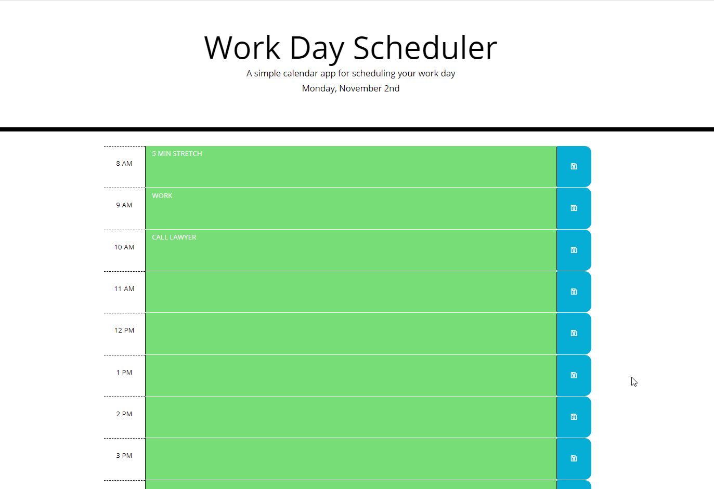

# DayScheduler
## Description
It is a daily organizer, where you can keep track of your activities and also make changes according to if is done or in process.
## Table of Contents 
  * [Installation](#installation)
  * [Usage](#usage)
  * [Contributing](#contributing)
  * [Questions](#questions)
  * [Page Preview](#page-preview)
  
## Installation
No Installation needed

## Usage  
  * [Link to app](https://pochobs.github.io/DayScheduler/)
  * [Github](https://github.com/pochobs/DayScheduler)  
    
## Contributing
No contribution is needed
   
## Questions
  
If you have any questions about the repo, open an issue or contact me directly at [pochobs@gmail.com](mailto:pochobs@gmail.com). You can find more of my work at [Pochobs](https://github.com/pochobs/).

## Page Preview
Home Page Preview:

